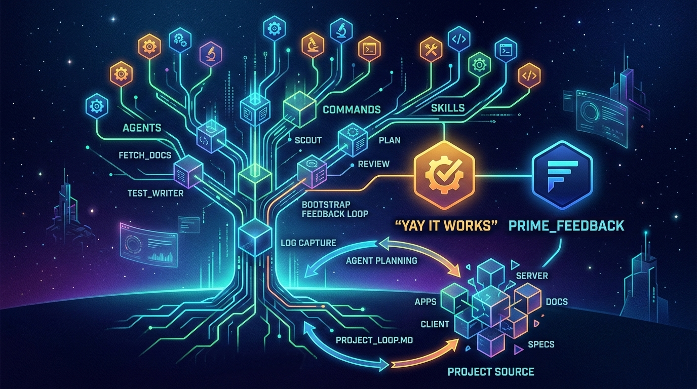

# Agentic Project

This is a skeleton project designed for Agentic Development, structured to support AI agents with defined skills, commands, and documentation.

Just drag and drop `.agents/` and `AGENTS.md` into your project, or run:

```bash
python3 scripts/bootstrap_agents.py /path/to/your/project
```

The script copies `.agents/` and `AGENTS.md` into the target folder. When files already exist, it prompts: **Overwrite**, **Skip**, **Diff**, or **Merge** (append for .md files). Use **All overwrite** or **All skip** to apply the same choice to remaining conflicts.

Don't forget to run **Prime** to familiarize the agent with your codebase, and **prime_feedback** (`.agents/commands/prime_feedback.md`) to set up your project for autonomous, self-correcting development.

**WARNING!:** *Don't fall into the agentic trap!!!* Using agents or too many rules to follow can drastically decrease your LLM output quality! Read more at the end of this file. Keep AGENTS.md around 200 instructions tops. Read below why. 

### Maturity Levels

From Copy-Paste to Autonomous Development

| Level | Quality | Speed | What you get |
|-------|---------|-------|--------------|
| **1** | 1.5x | 1.5x | You use chatgpt.com in the browser and copy-paste code |
| **2** | 2x | 2x | You advance to IDEs and TUI tools |
| **3** | 2.5x | 2.5x | You start using the "PLAN" agent before tackling anything big |
| **4** | 3x | 3x | You start using the "ASK" agent before any PLAN — two questions: *Any questions? Any concerns?* |
| **5** | 3.5x | 3x | You use different models for different tasks. You minimize context degradation. You know your token limits and use think-first vs tool-first models properly |
| **6** | 4x | 4x | You start using `AGENTS.md` and `skills/commands` for each of your projects |
| **7** | 4.5x | 4.5x | You don't fall into the agentic trap — one giant context, one confused agent, zero results. You split responsibilities across multiple focused agents and MD files |
| **8** | 5x | 6x | You prime your projects with `prime.md`. You let your agents know about and control your project |
| **9** | 6x | 10x | You set up full **Autonomous Feedback Loop** — agents run linters, run tests, they run and catch exceptions and runtime errors, read logs, build outputs, and even the browser console. You setup agents to see and interact with the Frontend directly. You achieve a **100% automated testing feedback loop**. You gain 2–3× better results & speed |
| **10** | 7x | 12x | You write specifications as long prompts using another LLM |
| **11** | 8x | 13x | You leave out the context-heavy work until the MVP is ready — anything with an avalanche effect on the codebase |
| **12** | 9x | 15x | You create frontend designs upfront using CSS themes alongside the specification. When done, you ask 10–20×: *"What is NOT implemented?"* — use OUTPUT as PLAN → BUILD → repeat |
| **13** | 10x | 16x | You start asking: *"Search GitHub — maybe someone already did this?"* and you integrate rather than implement |
| **14** | 11x | 18x | You setup LSP, Vector DB and MCP together. Your agents have structural code understanding with long-term memory. Your stack becomes a living, connected organism |
| **15** | 12x | 20x | Your agents remember your coding style, libraries, and past mistakes across projects. Every new project starts with accumulated context. You version control your prompts and agent configs — `AGENTS.md`, `prime.md`, `MEMORY.md` in git like any other codebase asset |
| **16** | 13x | 20x | You setup sandboxed environments, boundaries, permissions and protect yourself against prompt injections |
| **17** | 15x | 25x | You orchestrate multiple specialized agents in parallel — planner, coder, reviewer, tester — running concurrently on the same task. You build a router that automatically sends tasks to the right model based on complexity and cost |
| **18** | 16x | 30x | You setup agents to see and interact with the frontend directly — a direct application of parallel orchestration. You achieve a **100% automated testing feedback loop** |
| **19** | 20x | 50x | You run a software business without a dev team. Agents handle implementation, testing, deployment, monitoring — including blue-green and canary deployments. You handle product and architecture. One person, the output of a 10-person team |


#### ONE DAY

| Level | What you get |
|-------|--------------|
| **1** | You don't touch code. You reply to LLM questions while agents run tests on the code |
| **2** | You swipe through a gallery of specifications, designs, and solutions — coded on the fly as you swipe |
| **3** | You use brainwaves to swipe left or right between designs, architectural choices, and business logic. You don't type, talk, or look. An AI helmet flashes images in your brain and gets prompts from your brainwave activity |


Special thanks to **@IndyDevDan** and his Youtube video that inspired this project: [Youtube video](https://www.youtube.com/watch?v=fop_yxV-mPo)

## Overview
1. **Agents / Commands / Skills**: `.agents/` directory
2. **Project Specs**: `specs/` that you create as big promts with progress tracking. This is bigger than just a simple "PLAN".
3. **Reviews**: `reviews/` done by agents (security audits, etc)
4. **Docs**: `docs/` for the LLM agents

## Agents & Commands
- **Prime**: `prime [query]`
- **Bootstrap Feedback Loop**: `prime_feedback` — One-time setup for autonomous, self-correcting development (log capture, process output, `.agents/PROJECT_LOOP.md`)
- **Plan**: `plan [id] [prompt]`
- **Scout**: `scout [query]`
- **Review**: `review [feature]`
- **Test Writer**: `test_writer`
- **Documentation Fetcher**: `fetch_docs [urls]`

## Project Structure

```text
.
├── .agents/                    # Agents, Commands, and Skills (vendor-neutral)
│   ├── agents/                 # Agent definitions
│   │   ├── fetch_docs.md       # Documentation fetcher agent
│   │   ├── review_agent.md     # Code review agent
│   │   ├── scout.md            # Codebase scout agent
│   │   └── test_writer.md      # Test writing agent
│   ├── commands/               # Command definitions
│   │   ├── prime_feedback.md   # Autonomous feedback loop setup
│   │   ├── build.md            # Build/implementation command
│   │   ├── document.md         # Documentation generator
│   │   ├── plan.md             # Planning command
│   │   ├── prime.md            # Codebase priming
│   │   ├── pull_ticket.md      # Jira ticket puller
│   │   ├── reproduce.md        # Bug reproduction
│   │   ├── review.md           # Code review command
│   │   ├── scout.md            # Scout command
│   │   ├── start_apps.md       # App startup command
│   │   ├── test_be.md          # Backend testing
│   │   └── test_fe.md          # Frontend testing
│   └── skills/                 # Executable skills
│       ├── db-migrate/         # Database migration skill
│       └── start-stop-app/     # App lifecycle management
├── docs/                       # Project documentation for AI context
├── apps/                       # Application source code
│   ├── client/                 # Python client application
│   └── server/                 # FastAPI/Python server application
├── specs/                      # Technical specifications
└── AGENTS.md                   # Main entry point for AI agents
```

## Reference Links
- [Youtube video](https://www.youtube.com/watch?v=fop_yxV-mPo)
- [Agentic Engineer](https://agenticengineer.com/)
- [Model Context Protocol (MCP)](https://modelcontextprotocol.io/)


# LLM Instruction-Following Capacity

> Research-backed data on how many instructions LLMs can follow simultaneously, across multiple benchmarks and sources.

Last updated: February 2026

---

## The Core Question

> **"How many instructions can an LLM follow with reasonable consistency?"**

---

## Source Index

| # | Source | Type | What it measures |
|---|---|---|---|
| S1 | **IFScale** — Distyl AI (July 2025) | Academic benchmark | Accuracy at 10→500 simultaneous keyword instructions |
| S2 | **"Curse of Instructions"** — ICLR 2025 | Academic paper | Success rate at exactly 10 simultaneous instructions |
| S3 | **AGENTIF** — Tsinghua University (2025) | Academic benchmark | Constraint success in real agentic scenarios |
| S4 | **IFEval** — Scale AI leaderboard | Standard benchmark | Single-constraint accuracy (simple, verifiable) |
| S5 | **HumanLayer blog** | Practitioner estimate | Rule-of-thumb from production deployments |
| S6 | **Qualitative / coding evals** | Real-world testing | Observed behavior in coding tasks |

---

## Master Comparison Table

| Model | S1: IFScale @ 500 instr. | S2: 10 instr. success | S3: AGENTIF agentic | S4: IFEval (simple) | Decay pattern | Notes |
|---|---|---|---|---|---|---|
| **o3** (OpenAI) | **62.8%** 🥇 | — | — | **91.96%** 🥇 | Threshold | Best overall; holds until cliff |
| **gemini-2.5-pro** | **~65%** 🥇 | — | — | 86.58% | Threshold | Holds stable longest before breaking |
| **grok-3** | **61.9%** | — | — | — | Stable | Near o3 performance, no reasoning mode |
| **GLM-4.7** | not tested | — | 41% Terminal Bench | **88%** ⭐ | unknown | Best open-source IFEval; interleaved thinking |
| **GLM-4 (32B)** | not tested | — | TAU-Bench strong | **87.6%** | unknown | Highest IFEval for its size class |
| **DeepSeek R1** | 30.9% | — | — | **87.75%** 🥈 | Collapse | Strong IFEval, but collapses at high density |
| **claude-3.7-sonnet** | **52.7%** | — | — | — | Linear | Predictable; older model outperforms newer |
| **Claude 3.5 Sonnet** | — | **44%** → 58%* | — | 85.96% | Linear | *improves to 58% with self-refinement feedback |
| **GPT-4.1** | linear decay | — | — | — | Linear | Steady, predictable decline |
| **claude-opus-4** | **44.6%** | — | — | — | Linear | Surprisingly weaker than claude-3.7 |
| **claude-sonnet-4** | **42.9%** | — | unstable 150-300 | — | Linear | Critical instability zone at mid-density |
| **o1-mini** | — | — | **59.8%** CSR best | — | — | Best constraint success rate in agentic eval |
| **deepseek-r1** | **30.9%** | — | — | 87.75% | Collapse | Underperforms for a reasoning model at density |
| **qwen3** | **26.9%** | — | — | — | Collapse | Below expectations for large new-gen model |
| **GPT-4o** | **~15%** 💀 | **15%** 💀 | 58.5% (↓ from 87%) | 85.29% | Exponential | Most misleading model — great on paper, fails in practice |
| Frontier models (general) | — | — | — | — | — | ~150–200 instructions "reasonable" (practitioner est.) |
| Mid-tier models | collapse 150–300 | — | — | — | — | Critical instability zone |
| Worst models | collapse at ~20–30 | — | — | — | — | Overwhelmed by a few dozen |

---

## Rankings — Best to Worst Overall

### 🟢 Top Tier — Holds under pressure

| Rank | Model | Strength | Weakness |
|---|---|---|---|
| 1 | **o3** | IFEval 91.96%, IFScale 62.8%, threshold decay | Very slow at high density (219s @ 250 instr.) |
| 2 | **gemini-2.5-pro** | ~65% @ 500 instr., holds stable longest | Variance increases as it approaches cliff |
| 3 | **grok-3** | 61.9% @ 500 instr., low variance, no reasoning mode needed | Less tested overall |
| 4 | **GLM-4.7** | 88% IFEval, interleaved thinking, open-source, MIT licensed | Not tested at high instruction density |
| 5 | **GLM-4 (32B)** | 87.6% IFEval, strong tool use (TAU-Bench) | Older, smaller model |

### 🟡 Middle Tier — Predictable but degrading

| Rank | Model | Strength | Weakness |
|---|---|---|---|
| 6 | **claude-3.7-sonnet** | 52.7% @ 500, linear decay — easy to plan around | Older model |
| 7 | **Claude 3.5 Sonnet** | 85.96% IFEval, improvable with feedback | 44% on 10 simultaneous — needs self-correction |
| 8 | **GPT-4.1** | Linear decay pattern — consistent | No IFScale score published |
| 9 | **claude-opus-4** | 44.6% @ 500 | Weaker than its older predecessor (3.7) |
| 10 | **claude-sonnet-4** | 42.9% @ 500 | Unstable in 150–300 instruction zone |

### 🔴 Bottom Tier — Collapses early

| Rank | Model | Issue |
|---|---|---|
| 11 | **deepseek-r1** | 30.9% @ 500 — underperforms for a reasoning model |
| 12 | **qwen3** | 26.9% @ 500 — below expectations |
| 13 | **GPT-4o** | **Worst overall** — 15% @ 500 AND 15% at just 10 instructions; exponential decay; floors at 7–15% |

---

## Degradation Patterns Explained

Three distinct patterns emerge from the IFScale study (Distyl AI, 2025):

### 1. Threshold Decay 📉
**Models: o3, gemini-2.5-pro**

```
Accuracy
100% |████████████████████
 80% |                    ████
 60% |                        ██████
 40% |                              ████████
     |__________________________|_________
     0        100       200      300     500 instructions
                              ^ cliff point
```
- Near-perfect performance until a critical density threshold
- Then: rising variance and steeper decline
- **Best pattern for real-world use** — you know the safe zone

### 2. Linear Decay 📉
**Models: gpt-4.1, claude-3.7-sonnet, claude-sonnet-4**

```
Accuracy
100% |██
 80% |  ████
 60% |      ████
 40% |          ████
 20% |              ████
     |________________________
     0    100    200    300    500 instructions
```
- Steady, predictable decline across the density spectrum
- **Most manageable in production** — degradation is foreseeable
- No sudden cliffs

### 3. Exponential Decay 💀
**Models: gpt-4o, llama-4-scout, claude-3.5-haiku**

```
Accuracy
100% |██
 80% |  ██
 60% |    ██
 40% |      █
 20% |       █████████████████ (floor ~7-15%)
     |________________________
     0  20  50   100   200   500 instructions
```
- Rapid early collapse
- Levels off at accuracy floor of 7–15%
- **Avoid for instruction-dense tasks entirely**

---

## Key Research Findings

### Finding 1 — IFEval scores are misleading
Simple benchmarks flatter models dramatically. GPT-4o scores **85.29% on IFEval** (simple, single constraints) but **15% on 10 simultaneous real instructions** (Curse of Instructions, ICLR 2025). The gap between benchmark and reality is enormous.

### Finding 2 — The "150–200 instructions" rule is optimistic
The practitioner estimate of 150–200 instructions (HumanLayer blog) applies only to top-tier frontier models under ideal conditions. Research shows:
- Mid-tier models start breaking at **50–100 instructions**
- Worst models collapse at **~20–30 instructions**
- Even best models drop below 70% accuracy at 500 instructions

### Finding 3 — Reasoning models trade speed for capacity
Reasoning models (o3, o4-mini) hold more instructions but get dramatically slower:
- o4-mini: 12.4s → 436.19s as density goes from 10 → 250 instructions
- o3: 26.3s → 219.58s at 250 instructions
- General-purpose models: stable latency regardless of density

### Finding 4 — Primacy bias is universal
All models pay more attention to **earlier instructions** than later ones. In long instruction lists, instructions at the end are most likely to be dropped. This has a direct implication: **put your most important rules first**.

### Finding 5 — Agentic scenarios are harder
Real agentic tasks (chained, multi-step, tool-using) perform far worse than single-prompt benchmarks:
- GPT-4o: 87% IFEval → **58.5% AGENTIF** (32% drop)
- o1-mini best CSR in agentic: only **59.8%**

### Finding 6 — 10 instructions is already hard
"Curse of Instructions" (ICLR 2025): at just **10 simultaneous instructions**, GPT-4o only succeeds 15% of the time. Even Claude 3.5 Sonnet manages only 44%. This is the most sobering finding in all the research.

---

## Practical Implications for CLAUDE.md / Spec Files

| File | Recommended limit | Reasoning |
|---|---|---|
| `CLAUDE.md` (global rules) | **< 60 lines** | Goes into every session; competes with system prompt (~50 instr. already used) |
| `spec.md` / PRP | Can be longer | Focused on one task; model isn't holding competing contexts |
| Per-step instructions | **< 10 clear rules** | "Curse of Instructions" shows 10 is already hard for most models |
| Total instruction budget | **~150 for top models** | 200 is optimistic; plan for degradation starting at 100 |

### Rule of thumb
> **Every instruction you add costs you something on every other instruction.**
> The question is always: is this instruction worth the tax it puts on everything else?

---

## GLM Special Notes

GLM (Zhipu AI / Z.ai) is notable because:

1. **Strong IFEval for open-source**: GLM-4.7 scores 88%, GLM-4 (32B) scores 87.6% — above GPT-4o and Claude 3.5 Sonnet on the simple benchmark
2. **Not tested in IFScale** — no high-density data available yet
3. **Architectural advantage**: GLM-4.7 introduces Interleaved Thinking — reasons before every response and tool call, which improves instruction adherence in complex scenarios
4. **Agent improvement**: Terminal Bench 2.0 jumped from 24.5% (GLM-4.6) to 41.0% (GLM-4.7) — a +16.5% gain in real multi-step task execution
5. **Open-source / MIT licensed** — self-hostable; relevant for privacy-sensitive deployments

---

## Summary — What Actually Works

| Strategy | Effect |
|---|---|
| Keep global rules under 60 lines | Prevents diluting the most important constraints |
| Put critical instructions first | Exploits primacy bias in your favor |
| Use layered specs (global + per-task) | Avoids cognitive overload in single context |
| Use reasoning models for instruction-dense tasks | o3/gemini-2.5-pro hold up better at high density |
| Don't rely on IFEval scores alone | They overestimate real-world performance significantly |
| Test with self-refinement feedback | Claude 3.5 Sonnet improves from 44% → 58% at 10 instructions with feedback |

---

## Sources

| Source | URL |
|---|---|
| IFScale benchmark (Distyl AI, 2025) | https://arxiv.org/abs/2507.11538 |
| "Curse of Instructions" (ICLR 2025) | https://openreview.net/forum?id=R6q67CDBCH |
| AGENTIF benchmark (Tsinghua 2025) | https://keg.cs.tsinghua.edu.cn/persons/xubin/papers/AgentIF.pdf |
| Scale AI IFEval Leaderboard | https://scale.com/leaderboard/instruction_following |
| HumanLayer — Writing a good CLAUDE.md | https://www.humanlayer.dev/blog/writing-a-good-claude-md |
| GLM-4.7 benchmarks | https://automatio.ai/models/glm-4-7 |
| GLM-4 (32B) IFEval | https://www.marktechpost.com/2025/04/14/thudm-releases-glm-4 |
